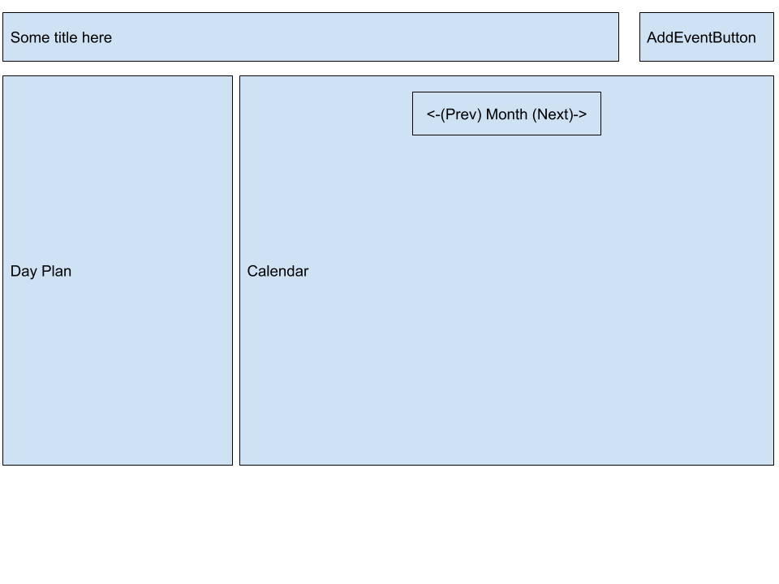

# DailyChecklist
Objective:
- To create a calendar-like web app that will have a checklist daily.
- This checklist's items will be added and removed by the user initially, then onwards from the day of creation/deletion, the checklist will/will not contain that entry automatically.

Technical Details:
- Frontend: AngularJS
- Backend: NodeJS, MongoDB?

# Terminology
`Day Plan` - the checklist

`Event` - an item on the day plan that's been added by the user

`Date` - formatted as `2020-08-01` (month starts at 1, day starts at 1)

`Day of Month (dMonth)` - in `2020-08-01`, the `dMonth` would be `1`

`Day of Week (dWeek)` - Sunday=0, Monday=1, ..., Saturday=6

# Design and Documentation
<details>
<summary>Frontend</summary>

# Frontend
## General Overview
There will be one endpoint available, the root endpoint: `{base-url}/`

*TODO: The user will need to log in to access their calendar. Most likely through some username/password.*

The page will contain a calendar on the right (represented by `Calendar` component):
- 6 rows (showing days of the month)
- each row spans Sunday, Monday, ..., Saturday
- each of the days will be represented by a `CalendarCell` component
- the user can navigate between months (via prev/next buttons)
- each `CalendarCell` will be clickable and will update the day plan accordingly

It will also contain a day plan on the left:
- with events added by user
- upon initial launch, the default day plan will be today's date (timezone applied)
- the user can change the day plan by navigating to another date
- the events can be completed/incomplete
- user is also able to go back in time and change status of events by clicking on the events
- HOWEVER, they cannot go forward in time to change the status (in order to implement this, future dates should not have events pre-populated)

It will also contain an Add Event button:
- clicking on this button will show a modal, where the user can specify:
    - title of event
    - start date
- upon creation success/failure, message is provided accordingly

## Components
### $ AppComponent
> Holds the CalendarComponent, AddEventButtonComponent, DayPlanComponent.

### $ CalendarComponent
> Holds a list of `CalendarCellComponent`s, each representing a day in a month.

### $ CalendarCellComponent
> Holds a list of events to display in the cell.
>
> Events will be represented by a label, text overflow will becomes ellipsis.
> - Completed events will be highlighted in green
> - Incomplete events will be highlighted in gray

### $ AddEventButtonComponent
> Clicking on the button will open a modal.
>
> The modal will include:
> - Title of event [text field]
> - Start date [date field]
> - Save button
> - Cancel button (only way to exit modal)
> - Success/failure message

### $ DayPlanComponent
> Shows the list of events in full detail, text overflow will wrap to next line instead of becoming ellipsis.
>
> Always showing, default initial view will be today's date.

## Services
### CalendarService
> Provides information about the calendar such as current selected month, current selected date, current selected year

## Architecture


## Design

</details>


# Backend
## General Overview
- Backend will use NodeJS with Express to handle HTTP requests
- Database used will be MongoDB, for document structures, see `Models` section
- (TODO) Some kind of authentication process for user login

<details>
<summary>Endpoints available:</summary>

- `[GET] /api/events?startDate={start}&endDate={end}`
    - Header to include {user-id}
    - Gets the events for {user-id} from {start} to {end}
- `[POST] /api/events`
    - Header to include {user-id}
    - Adds a new event under the user
    - Expected request payload:
    ```
    {
        desc: String,
        date: String (yyyy-mm-dd)
    }

    Sample:
    {
        desc: 'testing description'
        date: '2020-08-01'
    }
    ```
- `[DELETE] /api/events/{event-id}`
    - Header to include {user-id}
    - Deletes an event from the user
- `[POST] /api/events/{event-id}`
    - Header to include {user-id}
    - Updates the status of an event on a date
    - Expected request payload:
    ```
    {
        date: String (yyyy-mm-dd),
        isComplete: Boolean
    }

    Sample:
    {
        date: '2020-08-01',
        isComplete: true
    }
    ```
</details>
<br>

## Document Models
### $ Event
```
{
    _id: ObjectId, (auto-generated by MongoDB)
    userId: Number,
    desc: String,
    isActive: Boolean,
    dates: [
        {
            date: String, (yyyy-mm-dd)
            isComplete: Boolean
        }
    ]
}
```

### $ User
```
{
    id: Number
}
```